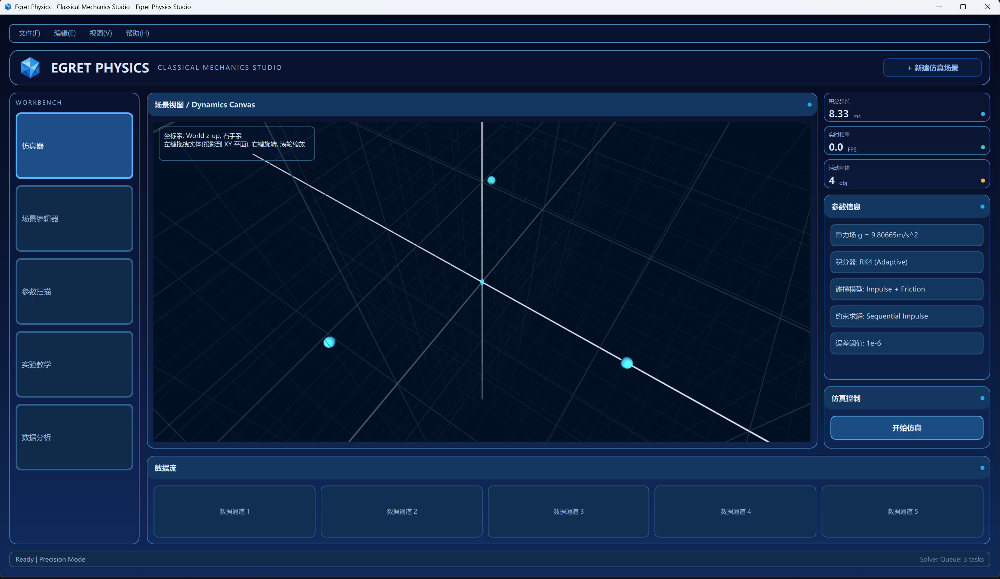

# Egret Physics

A modern physics simulation engine with rigid body dynamics, collision detection, and constraint solving.



## Features

- **Rigid Body Dynamics**: Support for various rigid body shapes including spheres, boxes, cylinders, rings, disks, rods, and shells
- **Collision Detection**: Comprehensive collision detection system with multiple shape combinations
- **Constraint Solving**: Support for constraints including support surfaces, sliding rails, connecting lines, and connecting rods
- **Physics Fields**: Gravity and gravitational field support
- **Simulation Strategy**: Configurable broad-phase strategy, contact resolver, and integrator strategy
- **Qt-based UI**: Modern QML-based user interface with 3D visualization support

## Dependencies

| Library | Version | License |
|---------|---------|---------|
| Boost | 1.90.0 | Boost Software License 1.0 |
| Eigen | 5.0.0 | Mozilla Public License 2.0 |
| Qt | 6.9.3 | LGPLv3/GPLv3 |

## Building

### Prerequisites

- CMake 3.30.1 or later
- Qt 6.9.3 (with Core, Gui, Widgets, Quick, Qml, Quick3D, Sql modules)
- MSVC 2022 (Windows) or compatible C++ compiler

### Build Instructions

```bash
mkdir build
cd build
cmake ..
cmake --build . --config Release
```

### Build Options

- `BUILD_TESTS`: Build unit tests (default: ON)
- `DEBUG_SIMULATE_RELEASE`: Simulate Release behavior in Debug build (default: OFF)

## Project Structure

```
Egret Physics/
├── src/                    # Source code
│   ├── main.cpp            # Application entry point
│   ├── model/              # Core physics model
│   │   ├── physics/        # Physics engine components
│   │   │   ├── rigid/      # Rigid body systems
│   │   │   ├── field/      # Physics fields
│   │   │   └── constraints/# Constraints
│   │   ├── solver/         # Simulation solver
│   │   ├── scene/          # Scene management
│   │   └── strategy/       # Simulation strategies
│   ├── view_model/         # View models for UI
│   ├── view/               # UI views
│   └── utils/              # Utility functions
├── dependency/             # Third-party dependencies
│   └── include/            # Header-only libraries
├── resources/              # Resources
├── tests/                  # Unit tests
└── CMakeLists.txt          # Build configuration
```

## License

This project is licensed under the GNU General Public License v3.0. See [GPL_V3.0.md](GPL_V3.0.md) for details.

For third-party library licenses, see [NOTICE](NOTICE).

## Contributing

Contributions are welcome! Please ensure your code follows the project's coding standards and includes appropriate tests.

## Contact

For questions or issues, please open an issue in the repository.
