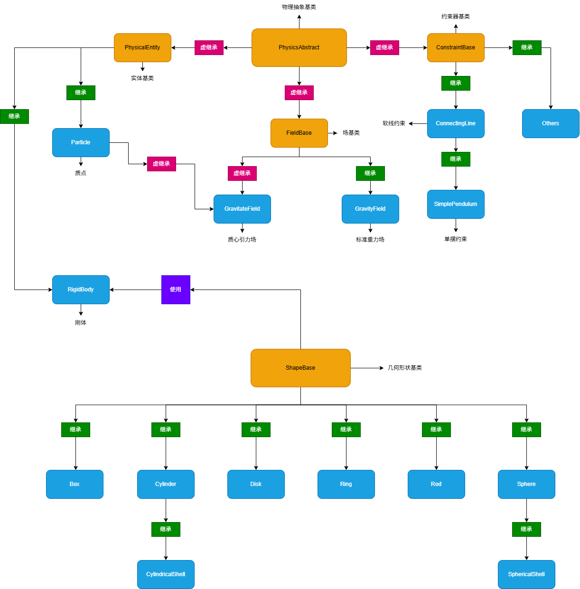

# Egret Physics


一个现代化的物理模拟引擎，支持刚体动力学、碰撞检测和约束求解。


## 特性

- **刚体动力学**：支持多种刚体形状，包括球体、立方体、圆柱体、圆环、圆盘、杆和壳体
- **碰撞检测**：全面的碰撞检测系统，支持多种形状组合
- **约束求解**：支持约束包括支撑面、滑轨、连接线和连接杆
- **物理场**：支持重力和质心引力场
- **模拟策略**：可配置的宽阶段策略、接触求解器和积分器策略
- **Qt 界面**：现代化的 QML 用户界面，支持 3D 可视化

## 物理模型架构

以下是物理引擎的核心类继承关系图：



## 依赖

| 库 | 版本 | 许可证 |
|---------|---------|---------|
| Boost | 1.90.0 | Boost Software License 1.0 |
| Eigen | 5.0.0 | Mozilla Public License 2.0 |
| magic_enum | 0.9.8 | MIT License |
| Qt | 6.9.3 | LGPLv3/GPLv3 |

## 快速开始

### 前提条件

- CMake 3.30.1 或更高版本
- Qt 6.9.3（需包含 Core、Gui、Widgets、Quick、Qml、Quick3D、Sql 模块）
- MSVC 2022（Windows）或兼容的 C++ 编译器

### 构建说明

```bash
mkdir build
cd build
cmake ..
cmake --build . --config Release
```

### 构建选项

| 选项 | 描述 | 默认值 |
|--------|-------------|---------|
| `BUILD_TESTS` | 构建单元测试 | ON |
| `DEBUG_SIMULATE_RELEASE` | 在 Debug 构建中模拟 Release 行为 | OFF |

### 运行应用

构建完成后，从构建目录运行可执行文件：

```bash
# Windows
./Release/Egret_Physics.exe

# Linux（如适用）
./Egret_Physics
```

## 项目结构

```
Egret Physics/
├── src/                    # 源代码
│   ├── main.cpp            # 应用入口点
│   ├── model/              # 核心物理模型
│   │   ├── physics/        # 物理引擎组件
│   │   │   ├── rigid/      # 刚体系统
│   │   │   ├── field/      # 物理场
│   │   │   └── constraints/# 约束
│   │   ├── solver/         # 模拟求解器
│   │   ├── scene/          # 场景管理
│   │   └── strategy/       # 模拟策略
│   ├── view_model/         # UI 视图模型
│   ├── view/               # UI 视图
│   └── utils/              # 工具函数
├── dependency/             # 第三方依赖
│   └── include/            # 头文件库
├── resources/              # 资源（图标、RC 文件）
├── tests/                  # 单元测试
└── CMakeLists.txt          # 构建配置
```

## 使用方法

### 创建物理场景

```cpp
#include "model/scene/world_scene_manager.h"
#include "model/solver/solver.h"
#include "model/strategy/integrator_strategy/semi_implicit_euler_integrator.h"
#include "model/strategy/broad_phase_strategy/brute_force_broad_phase.h"
#include "model/strategy/contact_strategy/frictionless_contact_resolver.h"

// 使用默认配置创建求解器
egret::SolverConfig config{};
auto integrator = std::make_unique<egret::SemiImplicitEulerIntegrator>();
auto broadPhase = std::make_unique<egret::BruteForceBroadPhase>();
auto contactResolver = std::make_unique<egret::FrictionlessContactResolver>();

auto solver = std::make_unique<egret::Solver>(
    config,
    std::move(integrator),
    std::move(broadPhase),
    std::move(contactResolver)
);

// 创建场景管理器
auto scene = std::make_unique<egret::WorldSceneManager>(std::move(solver));

// 添加重力场
scene->addGravityField({0, -9.81, 0}, {0, 0, 0}, "Gravity");

// 在位置 (0, 10, 0) 生成一个半径为 1.0、质量为 1.0 的球体
std::uint64_t sphereId = scene->spawnSphere("Sphere", {0, 10, 0}, {0, 0, 0}, 1.0, 1.0);

// 生成地面盒子（质量为 0 表示静态）
std::uint64_t groundId = scene->spawnBox("Ground", {0, -1, 0}, {0, 0, 0}, {10, 1, 10}, 0.0);

// 运行模拟（10 秒，60 FPS）
for (int i = 0; i < 600; ++i) {
    egret::SolverStepResult result = scene->tick(1.0 / 60.0);
    // 如有需要可访问模拟统计数据
    // std::cout << "Bodies: " << result.stats.bodyCount << std::endl;
}
```

### 添加约束

```cpp
// 创建单摆约束
// 锚点位置在 (0, 5, 0)，连接到球体
std::uint64_t pendulumId = scene->createSimplePendulum("Pendulum", 3.0, {0, 5, 0}, sphereId);

// 创建两个由线连接的球体
std::uint64_t bodyA = scene->spawnSphere("Ball A", {-2, 5, 0}, {0, 0, 0}, 0.5, 1.0);
std::uint64_t bodyB = scene->spawnSphere("Ball B", {2, 5, 0}, {0, 0, 0}, 0.5, 1.0);
std::uint64_t lineId = scene->createConnectingLine("Connector", 5.0, bodyA, bodyB);

// 启用/禁用约束
scene->setConstraintEnabled(pendulumId, false);
```

### 处理实体属性

```cpp
// 获取和设置物体位置
Eigen::Vector3d pos = scene->getBodyPosition(sphereId).value_or({0, 0, 0});
scene->setBodyPosition(sphereId, {0, 20, 0});

// 获取模拟时间和步数
double simTime = scene->getSimulationTime();
std::size_t stepCount = scene->getStepCount();

// 清空场景
scene->clear();
```

## 运行测试

运行单元测试：

```bash
cd build
ctest -C Release
```

## 许可证

本项目采用 GNU General Public License v3.0 许可。详情请参见 [GPL_V3.0.md](GPL_V3.0.md)。

第三方库许可证请参见 [NOTICE](NOTICE)。

## 贡献

欢迎贡献！请遵循以下指南：

1. Fork 仓库
2. 创建特性分支（`git checkout -b feature/my-feature`）
3. 进行修改并添加测试
4. 确保所有测试通过
5. 提交拉取请求

## 代码风格

本项目遵循 [Google C++ Style Guide](https://google.github.io/styleguide/cppguide.html)，以下是例外情况：
- 使用 4 个空格进行缩进（不使用制表符）
- 行长度限制为 120 字符

## 联系方式

如有问题或建议，请在仓库中提交 issue。